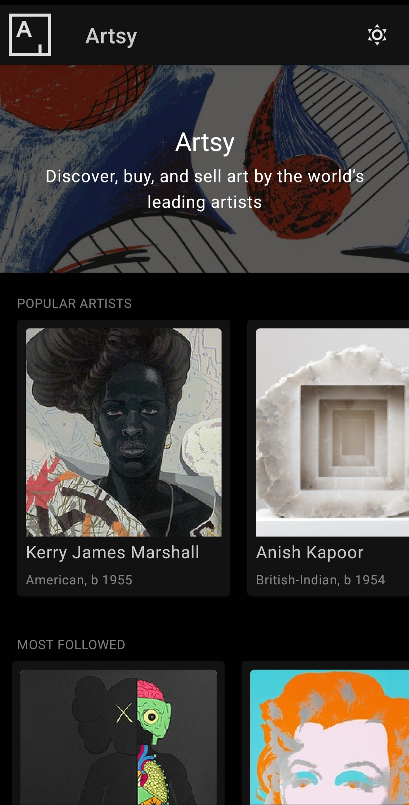
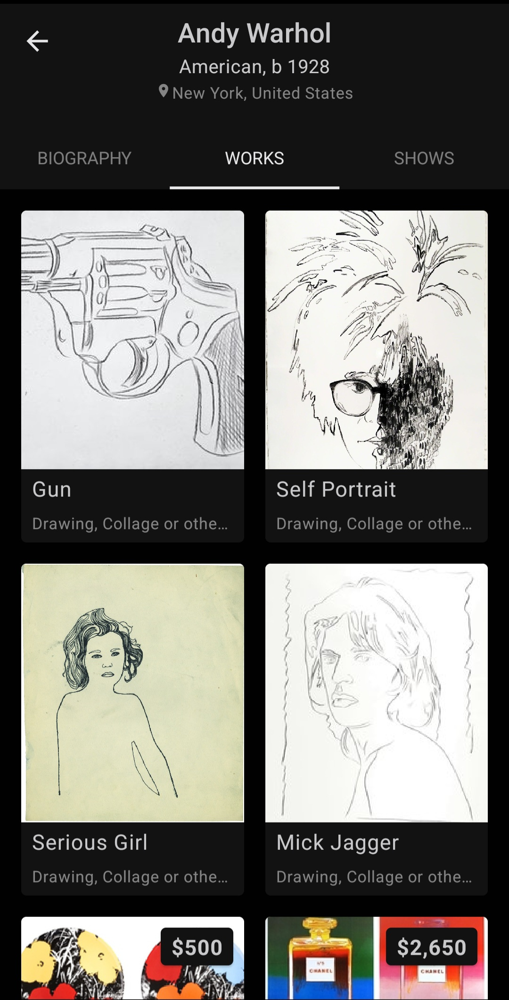
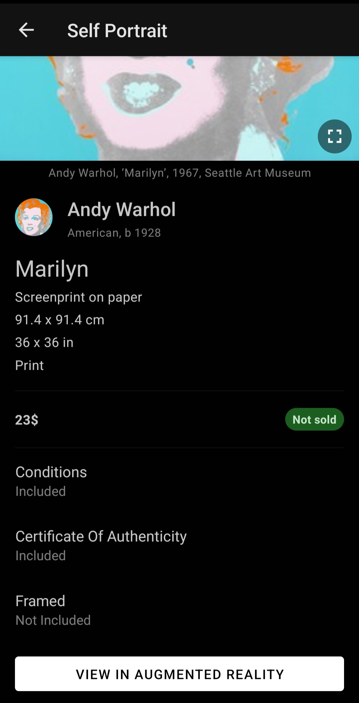

# Artsy Flutter App

A cross-platform Flutter client for [Artsy](https://www.artsy.net), the online marketplace for art and collectibles. The app browses artists, artworks, and gallery shows through Artsy's public GraphQL API ([Metaphysics](https://metaphysics-production.artsy.net)).

Built as a personal project to explore Flutter, GraphQL, and state management outside of React.

## Features

- **Artist discovery** — browse popular and trending artists on the home screen
- **Artist detail** — biography, represented artworks, and current/upcoming shows
- **Artwork detail** — full artwork information pulled live from the Artsy API
- **In-app web view** — opens Artsy web pages without leaving the app
- **Light/dark theme** — toggleable app-wide theme powered by `provider`
- **GraphQL data layer** — typed queries against Artsy's Metaphysics API via `graphql_flutter`, with mocked responses for offline development

## Screenshots

| Home | Artist Works | Artwork Detail |
| --- | --- | --- |
|  |  |  |

## Tech Stack

- [Flutter](https://flutter.dev) / Dart
- [graphql_flutter](https://pub.dev/packages/graphql_flutter) for data fetching
- [provider](https://pub.dev/packages/provider) for theme state
- [webview_flutter](https://pub.dev/packages/webview_flutter) for the in-app browser
- Targets iOS, Android, and Web from a single codebase

## Project Structure

```
lib/
├── components/    # Shared widgets (logo, theme toggle, empty states)
├── graphql/       # Apollo/GraphQL client, queries, models, mocks
├── pages/
│   ├── home/            # Artist list + header
│   ├── artistDetail/    # Biography, artworks, shows
│   └── artworkDetail/   # Single artwork view
└── utils/         # Routes, themes, error handling helpers
```

## Getting Started

```bash
flutter pub get
flutter run
```

Requires the [Flutter SDK](https://docs.flutter.dev/get-started/install) (Dart >=2.15.0 <3.0.0) and a connected device, simulator, or emulator.

## License

MIT © Navid Adelpour
